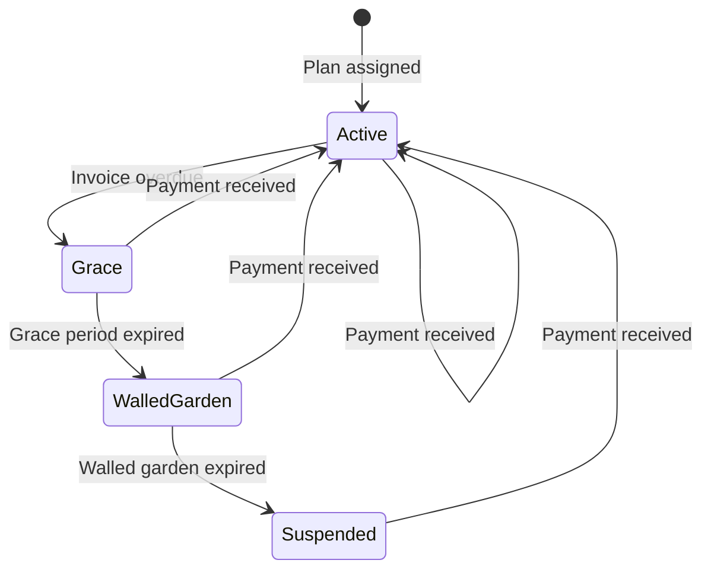

## Multi-Tenancy

FyberPay is a multi-tenant platform. Each ISP organization gets:

- A unique **subdomain** (e.g., `acme.fyberpay.com`)
- Isolated data (subscribers, invoices, payments)
- Independent configuration (plans, gateways, branding)
- Separate subscriber portal (`acme.fyberpay.com/portal`)

## Roles

| Role | Scope | Access |
|------|-------|--------|
| **Admin** | Organization | Full ISP management: billing, subscribers, network, settings |
| **Support** | Organization | Read-only access to subscribers and invoices, can create tickets |
| **Subscriber** | Portal | Self-service: view invoices, make payments, check usage |

## Subscription Lifecycle

A subscriber moves through these states:

- **Active**: Full internet access, RADIUS authorized
- **Grace**: Overdue but still connected, reminder SMS sent
- **Walled Garden**: Redirected to payment portal only (captive portal)
- **Suspended**: Disconnected, RADIUS rejects authentication

## Billing Cycle

FyberPay generates invoices automatically based on each subscriber's billing cycle:

1. **Invoice created** on the billing date
2. **STK Push sent** automatically (if M-Pesa configured)
3. **Payment reconciled** when M-Pesa callback received
4. **Dunning triggered** if payment not received within grace period

## Admin UI Structure

FyberPay's admin UI is organized into **hubs**, each grouping related operational surfaces under one tab:

| Hub | Tabs | What lives here |
|---|---|---|
| **Network** | Gateways, CPE (ONTs), SmartOLT, Sessions, Map, Health | Every device on your network. NAS devices, OLT chassis, customer-premises ONTs/routers, live RADIUS sessions, geo-mapped device health. |
| **Hotspot** | Packages, Vouchers, Portal | Captive-portal product catalogue. Time-based or data-cap packages, voucher batches, the org-themed portal designer. |
| **Messages** | SMS, WhatsApp, Emails | Communication channels. Templates, sent history, gateway credentials per channel. |
| **Insights** | Analytics, AI Intelligence | Subscribers, payments, churn, growth. AI-generated narrative insights about your business. |
| **Operations** | Audit log, Outbox events, Background jobs | Engineering / NOC view: what fired when, what failed, what's queued. |
| **Subscribers** | List, Leads | Customer-facing records. Existing subscribers and pre-conversion leads. |
| **Billing** | Invoices, Payments, Plans | Financial surface. Open/paid/overdue invoices, M-Pesa transaction reconciliation, plan catalogue. |

Settings are grouped at the bottom of the sidebar (General, Team, Billing & Dunning, Payment Gateways, Messaging, Network).

## Network Integration

FyberPay connects to your network infrastructure:

- **RADIUS (FreeRADIUS)**: Authentication, authorization, and accounting for PPPoE and Hotspot subscribers. See the [FreeRADIUS integration](/integrations/freeradius).
- **MikroTik RouterOS**: API-driven PPPoE / Hotspot / CPE-management services via the **NasService model**, with reconciler-based drift detection and a reserved-set guard against management-LAN corruption. See the [MikroTik integration](/integrations/mikrotik) and the [bridge-as-parent guide](/guides/mikrotik-bridge-as-parent).
- **GenieACS (TR-069)**: CPE auto-configuration for ONTs and routers (L3 management). See the [GenieACS integration](/integrations/genieacs).
- **SmartOLT**: GPON OLT management (L2 / OMCI for ONUs).

GenieACS and SmartOLT cover complementary layers: GenieACS handles the L3 / TR-069 path (WiFi config, firmware, customer-router parameters), SmartOLT handles L2 / OMCI on the OLT (ONU optical signal, port enable/disable, SLA enforcement). Most ISPs run both.

## Event-Driven Architecture

All operations in FyberPay flow through a transactional outbox:

1. Business operation executes (e.g., payment recorded)
2. Domain event written to outbox in the same transaction
3. Background processor dispatches event to listeners
4. Listeners handle side effects (RADIUS sync, SMS, ledger entry)

This ensures consistency: if the business operation succeeds, the side effects are guaranteed to eventually execute.
