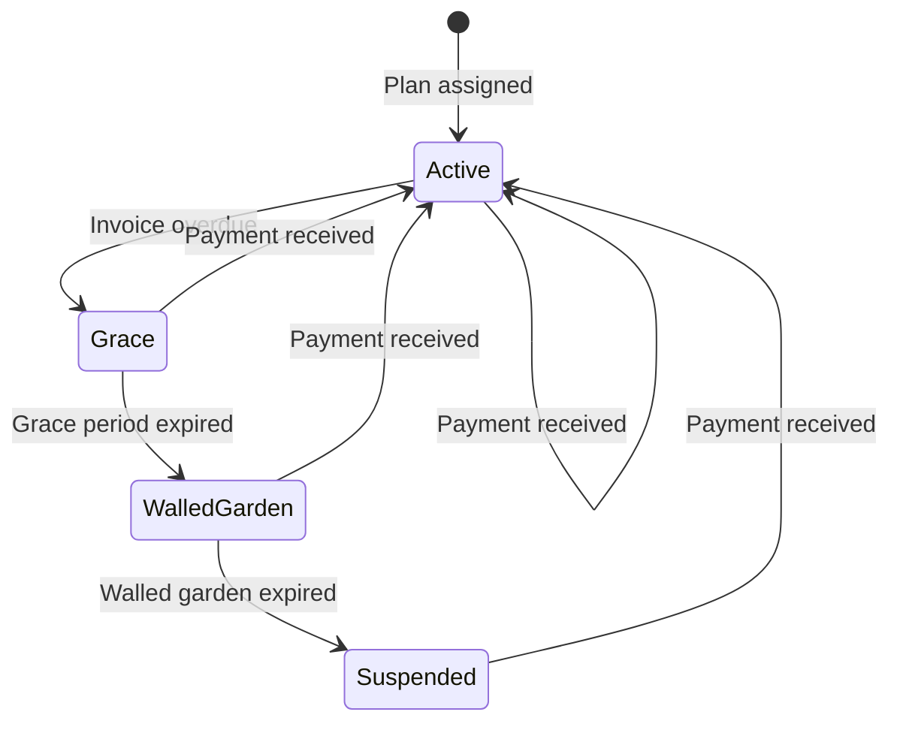

## Multi-Tenancy

FyberPay is a multi-tenant platform. Each ISP organization gets:

- A unique **subdomain** (e.g., `acme.fyberpay.com`)
- Isolated data (subscribers, invoices, payments)
- Independent configuration (plans, gateways, branding)
- Separate subscriber portal (`acme.fyberpay.com/portal`)

## Roles

| Role | Scope | Access |
|------|-------|--------|
| **Admin** | Organization | Full ISP management: billing, subscribers, network, settings |
| **Support** | Organization | Read-only access to subscribers and invoices, can create tickets |
| **Subscriber** | Portal | Self-service: view invoices, make payments, check usage |

## Subscription Lifecycle

A subscriber moves through these states:

- **Active**: Full internet access, RADIUS authorized
- **Grace**: Overdue but still connected, reminder SMS sent
- **Walled Garden**: Redirected to payment portal only (captive portal)
- **Suspended**: Disconnected, RADIUS rejects authentication

## Billing Cycle

FyberPay generates invoices automatically based on each subscriber's billing cycle:

1. **Invoice created** on the billing date
2. **STK Push sent** automatically (if M-Pesa configured)
3. **Payment reconciled** when M-Pesa callback received
4. **Dunning triggered** if payment not received within grace period

## Network Integration

FyberPay connects to your network infrastructure:

- **RADIUS (FreeRADIUS)**: Authentication, authorization, and accounting for PPPoE and Hotspot subscribers
- **MikroTik RouterOS**: Direct API sync for PPP secrets, hotspot users, bandwidth profiles, and queues
- **GenieACS (TR-069)**: CPE auto-configuration for ONTs and routers

## Event-Driven Architecture

All operations in FyberPay flow through a transactional outbox:

1. Business operation executes (e.g., payment recorded)
2. Domain event written to outbox in the same transaction
3. Background processor dispatches event to listeners
4. Listeners handle side effects (RADIUS sync, SMS, ledger entry)

This ensures consistency: if the business operation succeeds, the side effects are guaranteed to eventually execute.
